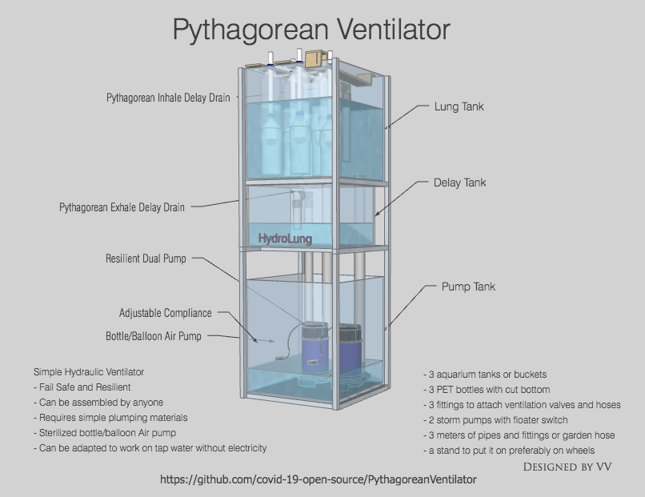

# Pythagorean Ventilator
A simple, fail safe, ventilator functioning based on a Pythagorean device. 
The ventilator can be rapidly and massively produced by anyone with basic plumping skills with parts abundantly available  in any hardware store.

The pandemia outbreak created an immediate demand impossible to source from traditional manufacturers. The Open movement that emerged is trying to develop slutions but the utilization of hobby electronics and mechanical contraptions harbors intrinsic dangers as bugs and glitches will result in DEATHS. Also most of the solution developed require skilled people to develop and manufacture/assemble/operate and materials that cannot be sourced in volumes of thousands.
Following a KISS approach this ventilator uses the minimum number of moving and fail prone parts while enabling anyone to assemble and operate it.

## Design Specs
- ** To be safe to be used on a patient that his life depends on it !!! **
- ** A minor glitch can instantly kill the patient !!! **
- Keep a sterile air passage
- Air passage easily sterilized per patient change or on demand
- ** Able to be produced in thousands in a couple of days **
- Utilize parts available in a garage or a store round the corner
- Anyone with plumping skills can make it
- Easily operable by medical personel with easy to understand operation
- Be able to operate in areas with no electricity (3rd world)

## Features

### Air pump (the Lung)
The air is pumped by a simple, fail safe, water water motion.
The water raises in an inversed chamber/cavity (water bottle or pipe) with an air outlet on top. As the water raises it pushes air out of the cavity and as it lowers it sucks air in. 
To achieve sterilisation and avoid moisture entering the air stream on top of the cavity there is a plastic bag (polybag or glove {gloves should be washed very well} ) that prevents air to water contact.
The openning is attached to standard or custom developed ventilator accessories.

## Lung Tank
The motion of the water column in the cavities (bottles) is generated by filling and draining the top "Lung" tank.
The tank can be filled by either 
- a pump, pumping water from a nearby (bottom) reservoir
- flowing tap water
- gravity fed water from a raised reservoir
In the top tank there is a drain pipe formed as the Greek letter Π (inverted U) which drains the Lung tank as soon as it reaches a certain level.
In case it is pump driven the pump stops pumping water at this point.
The water drains off, the water column in the cavities lowers and air is sucked in.

## Delay tank
The water from the Lung tank drains into the Delay tank. 
The purpose of the timer tank is to delay the start of the pump until the water is drained from the Lung tank.
It also features a Pythagorean device that drains the Delay tank as soon as water reaches predetermined level down to the Pump reservoir tank.

### Pump Tank 
The Pump Tank features multilple pumps (2 minimum) for resiliency which ideally are fed by separate power cords and sources.
As soon as the water fromm the Delay tank drains into the Pump tank the pump floater switches it on and sends water to the Lung tank, filling it and raising the water columnd in the Lung cavities.

(Continuously updated...)
